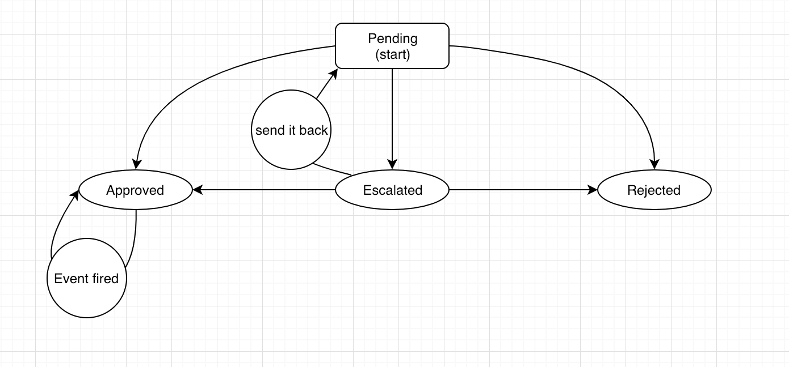
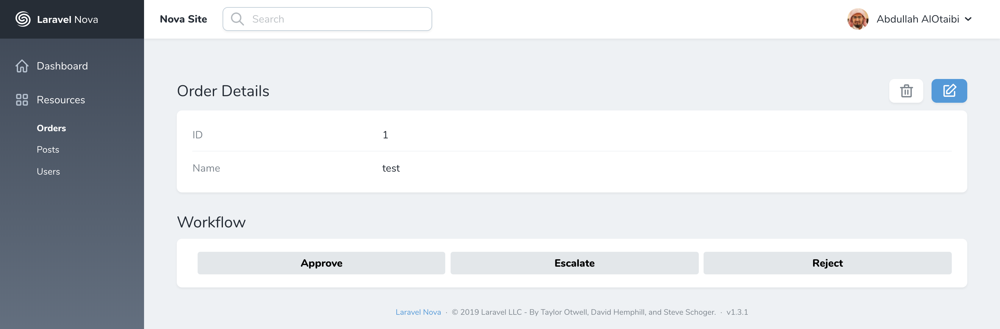

# Workflow Resource Tool for Laravel Nova

This package helps you to create workflow on your Nova application. It's built on top of this package  [winzou/state-machine](https://github.com/winzou/state-machine)






## Installation

You can install the package in to a Laravel app that uses [Nova](https://nova.laravel.com) via composer:

```bash
composer require cammac/nova-workflow
```

Next, publish the config file

```bash
php artisan vendor:publish --tag  workflow
```

open `config/workflow.php` and define your workflow

## Configuration


you can define inside `workflows` element workflow name and it's config as following:

| field          | mandatory  | Description                                                                                                            |
| -------------- | ---------- | ---------------------------------------------------------------------------------------------------------------------- |
| model          | Yes        | Model class you want to do your workflow on                                                                            |
| column         | Yes        | Column name you want to monitor                                                                                        | 
| states         | Yes        | All possible states                                                                                                    | 
| transitions    | Yes        | All possible transitions                                                                                               | 
| from           | Yes        | array: From states                                                                                                     | 
| to             | Yes        | To state                                                                                                               | 
| event          | No         | Event class that will be fired after the transition is completed                                                       | 
| style_classes  | No         | apply your css classes                                                                                                 | 
| with_reasons   | No         | string: column inside your model will be filled with the transition                                                    | 
| with_reasons   | No         | array:  will generate a dropdown list from with_reasons.model with `id` as option's value and `label` as option's text | 


## Usage

To display the workflow that are associated with a given Nova resource, you need to add the workflow Resource Tool to your resource.

For example, in your `app/Nova/Order.php` file:

```php

use Cammac\Workflow\Workflow;

...

public function fields(Request $request)
{
    return [
        ID::make()->sortable(),

        // Your other fields

        Workflow::make('request')->onlyOnDetail() // request is the workflow name defined in workflow configuration file

    ];
}
```

This will automatically search possible transitions for the current status

## License
The MIT License (MIT). Please see [License File](LICENSE.md) for more information.
